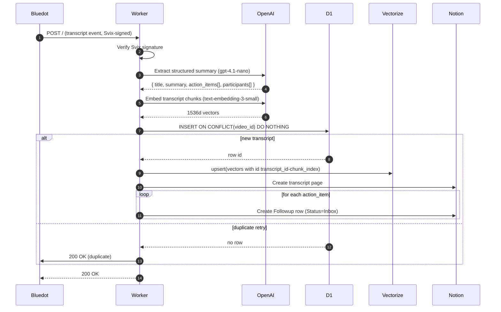

# bluedot-rag

> **Auto-ingest [Bluedot](https://bluedothq.com) meeting transcripts into Cloudflare D1 + Vectorize, and route action items into a Notion Followups inbox.**
>
> One Cloudflare Worker, one OpenAI key, one Notion integration. ~10 minutes from clone to first ingested call.

---

## What this does

Every time you record a meeting in Bluedot, this Worker:

1. Receives the webhook (Svix-verified)
2. Sends the transcript to OpenAI (`gpt-4.1-nano` for structured extraction, `text-embedding-3-small` for vectors)
3. Stores the transcript in Cloudflare **D1** with a unique constraint on the meeting id (idempotent against retries)
4. Upserts chunked embeddings into Cloudflare **Vectorize** for future RAG queries
5. Creates a Notion page in your **Call Transcripts** database (summary, participants, action items)
6. Creates one row per action item in your Notion **Followups** database with `Status = Inbox`

The Followups database is the actual product — a triagable inbox of every commitment from every call. No more "what did I promise to do?" — it's already in your inbox.

---

## Stack

| Layer | Technology |
|-------|------------|
| Webhook + processing | Cloudflare Workers |
| Transcript storage | Cloudflare D1 (SQLite) |
| Embeddings | Cloudflare Vectorize (1536d, cosine) |
| Action item extraction | OpenAI `gpt-4.1-nano` (structured outputs) |
| Vector embeddings | OpenAI `text-embedding-3-small` |
| Output surface | Notion API |
| Source | Bluedot webhooks (Svix-signed) |

**No Anthropic, no Neon, no SendGrid required.** Single OpenAI key + single Notion integration.

---

## Architecture



---

## 5-minute setup

### Prerequisites

| Service | Free tier | Why |
|---------|-----------|-----|
| [Cloudflare](https://dash.cloudflare.com) | Yes (Workers free, Vectorize requires paid plan ~$5/mo) | Hosting + storage + vectors |
| [OpenAI](https://platform.openai.com) | $5 credit, then ~$0.001/call | Extraction + embeddings |
| [Notion](https://notion.so) + [integration](https://www.notion.so/profile/integrations) | Yes | Output databases |
| [Bluedot](https://bluedothq.com) | Trial available | Meeting recordings |

### Setup

```bash
# 1. Clone
git clone https://github.com/jchu96/bluedot-rag.git
cd bluedot-rag
npm install

# 2. Authenticate with Cloudflare
npx wrangler login

# 3. Run the interactive setup
#    (creates D1, Vectorize, both Notion DBs; writes .dev.vars + wrangler.toml)
npm run setup

# 4. Deploy
npx wrangler deploy

# 5. Set production secrets (the values you used in setup, sent to Cloudflare)
npx wrangler secret put OPENAI_API_KEY
npx wrangler secret put NOTION_INTEGRATION_KEY

# 6. In Bluedot:
#    Settings → Webhooks → Add endpoint
#    URL = your worker URL (printed by `wrangler deploy`)
#    Subscribe to: meeting.transcript.created
#    Bluedot will give you a signing secret. Then:
npx wrangler secret put BLUEDOT_WEBHOOK_SECRET

# 7. Test by recording a Bluedot meeting; check logs:
npx wrangler tail
```

### Notion integration prep

Before running `npm run setup` you need:

1. Create an integration: https://www.notion.so/profile/integrations → "New integration" → Internal
2. Copy the integration token (starts with `ntn_`)
3. In your Notion workspace, create a parent page (e.g. "Bluedot RAG") for the new databases
4. On that parent page → ⋯ menu → "Add Connections" → select your integration
5. Get the parent page ID: it's the 32-char hex in the page URL after the title

The setup script will prompt for both the token and the parent page ID.

---

## Environment variables

| Variable | Type | Description |
|----------|------|-------------|
| `OPENAI_API_KEY` | secret | OpenAI key for extraction + embeddings |
| `NOTION_INTEGRATION_KEY` | secret | Notion integration token (`ntn_...`) |
| `BLUEDOT_WEBHOOK_SECRET` | secret | Svix signing secret from Bluedot's webhook config |
| `OPENAI_EXTRACTION_MODEL` | var | Default `gpt-4.1-nano`; override to upgrade later |
| `NOTION_TRANSCRIPTS_DATA_SOURCE_ID` | var | Set by setup script |
| `NOTION_FOLLOWUPS_DATA_SOURCE_ID` | var | Set by setup script |

Local dev: `.dev.vars` (gitignored). Production: `wrangler secret put` for secrets, `wrangler.toml` `[vars]` for non-secret config.

---

## Repo layout

```
src/
├── index.ts            # fetch entry — delegates to handler
├── handler.ts          # full pipeline orchestration
├── env.ts              # Env interface (D1, Vectorize, secrets)
├── webhook-verify.ts   # Svix signature verification
├── bluedot.ts          # Bluedot payload normalization
├── extract.ts          # OpenAI structured extraction
├── embeddings.ts       # OpenAI embeddings + chunking
├── d1.ts               # D1 transcripts table writes
├── vectorize.ts        # Vectorize upserts
├── notion.ts           # Notion API (transcript pages + followup rows)
├── schema.ts           # Drizzle SQLite schema
└── logger.ts           # Structured JSON logging

scripts/
├── setup.ts            # Interactive provisioning
└── smoke-vectorize.ts  # Vectorize round-trip smoke test

drizzle/                # Numbered SQL migrations
test/                   # Test setup helpers + ProvidedEnv typing
```

---

## Testing

```bash
# All tests (uses @cloudflare/vitest-pool-workers — real D1 in miniflare)
npx vitest run

# Watch mode
npx vitest

# Typecheck
npx tsc --noEmit
```

Tests cover Svix verification, payload normalization, OpenAI extraction (mocked), embeddings chunking, D1 idempotency, Vectorize upsert, Notion page builders, and full handler flows including a **dedup race test** (concurrent webhooks → exactly one D1 row).

---

## Operational notes

| Operation | How |
|-----------|-----|
| Tail live logs | `npx wrangler tail` |
| Reprocess a meeting | `DELETE FROM transcripts WHERE video_id = '...'` then re-fire from Bluedot's "Export to Webhook" |
| Check D1 contents | `npx wrangler d1 execute bluedot-rag-db --remote --command "SELECT id, video_id, title FROM transcripts ORDER BY id DESC LIMIT 10"` |
| List Vectorize entries | `npx wrangler vectorize get-by-ids bluedot-rag-vectors --ids "1-0,1-1"` |
| Replay a Svix event | Find the message in Bluedot's Svix dashboard, click Replay |

---

## Troubleshooting

**Notion 401/404 during setup:** the integration isn't shared with the parent page. Open the page → ⋯ → Add Connections → select your integration.

**Vectorize binding error in `wrangler dev`:** ensure `remote = true` is set on the binding in `wrangler.toml`.

**`Cannot read properties of undefined (reading 'call')` from Notion calls:** you imported the `@notionhq/client` SDK. Use direct `fetch` instead — the SDK doesn't work in workerd.

**OpenAI returns nulls in optional fields:** strict json_schema mode requires all properties be in `required`. We handle this in `cleanResult()` (extract.ts).

---

## Predecessor

This Worker evolved from a Neon-based prototype. See [REDACTED/docs/bluedot-pipeline.md](https://github.com/jchu96/REDACTED/blob/main/docs/bluedot-pipeline.md) for that earlier architecture.

---

## License

MIT — see [LICENSE](./LICENSE).
